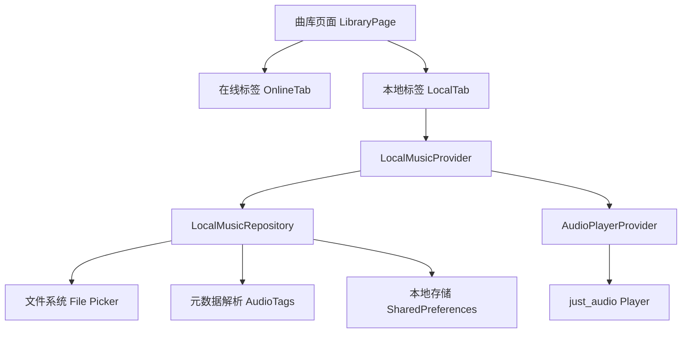
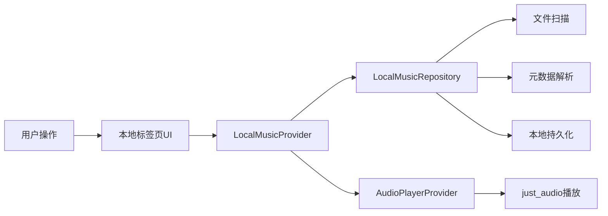

## 产品概述

在现有音乐应用的曲库页面中添加"本地"标签页，实现本地音乐文件的选择、扫描、管理和播放功能。采用纯本地模式，所有本地音乐文件仅在设备本地存储和播放，不上传至服务器，保护用户隐私。

## 核心功能

- **本地标签页**：在曲库页面新增"本地"标签，与"在线"音乐分开管理
- **文件选择与扫描**：支持用户手动选择音乐文件或扫描指定文件夹，识别常见音频格式（MP3、FLAC、WAV、AAC等）
- **本地音乐列表**：展示已添加的本地音乐，显示歌曲名、艺术家、时长、专辑封面等元数据
- **本地音乐播放**：使用现有 just_audio 播放器播放本地音乐文件
- **本地音乐管理**：支持删除、搜索、排序本地音乐列表
- **持久化存储**：本地音乐列表信息持久化存储，应用重启后保留

## 技术栈

- **框架**：Flutter（现有项目）
- **状态管理**：Riverpod（现有项目）
- **音频播放**：just_audio（现有依赖）
- **文件选择**：file_picker 插件
- **元数据读取**：audiotags 或 flutter_media_metadata 插件
- **本地存储**：shared_preferences 或 hive（存储本地音乐列表索引）

## 架构设计

### 系统架构

采用现有项目的分层架构，新增本地音乐模块：



### 模块划分

| 模块 | 职责 | 依赖 |
| --- | --- | --- |
| LocalMusicProvider | 本地音乐状态管理 | Riverpod |
| LocalMusicRepository | 本地音乐数据操作 | file_picker, audiotags |
| LocalMusicModel | 本地音乐数据模型 | 现有 Music 模型扩展 |
| LocalMusicListWidget | 本地音乐列表UI | Flutter Widgets |
| FileScannerService | 文件扫描服务 | file_picker |


### 数据流



## 实现细节

### 目录结构

```
lib/
├── features/
│   └── library/
│       ├── local/
│       │   ├── providers/
│       │   │   └── local_music_provider.dart
│       │   ├── repositories/
│       │   │   └── local_music_repository.dart
│       │   ├── models/
│       │   │   └── local_music_model.dart
│       │   ├── services/
│       │   │   └── file_scanner_service.dart
│       │   └── widgets/
│       │       ├── local_music_tab.dart
│       │       ├── local_music_list.dart
│       │       └── scan_folder_button.dart
│       └── library_page.dart (修改)
```

### 核心数据模型

```
class LocalMusic {
  final String id;
  final String filePath;
  final String title;
  final String? artist;
  final String? album;
  final Duration? duration;
  final String? coverPath;
  final DateTime addedAt;
}
```

### 技术实现要点

1. **文件权限**：Android 需要 READ_EXTERNAL_STORAGE 权限，iOS 需要访问媒体库权限
2. **元数据解析**：使用 audiotags 读取 ID3 标签信息
3. **状态持久化**：使用 shared_preferences 存储本地音乐文件路径列表
4. **播放集成**：复用现有 AudioPlayerProvider，传入本地文件 URI

## Agent Extensions

### SubAgent

- **code-explorer**
- 用途：探索现有项目结构，了解曲库页面实现、Music 模型定义、AudioPlayerProvider 实现方式
- 预期结果：获取现有代码结构和实现细节，确保新功能与现有架构一致