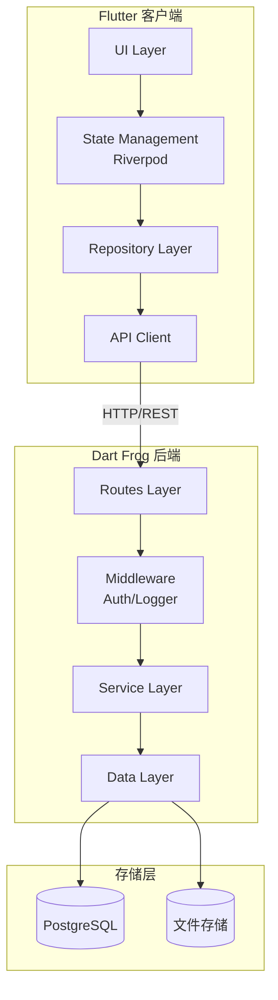
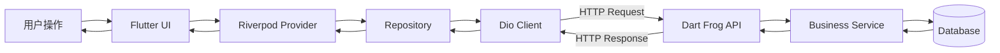

## 产品概述

基于 Dart 全栈技术栈实现的跨平台音乐播放软件。后端采用 Dart Frog 框架构建 RESTful API 服务，前端使用 Flutter 框架实现真正的跨平台支持，覆盖 iOS、Android、Windows、macOS 和 Linux 五大平台。系统支持用户上传音乐和服务端预置音乐库两种音乐来源方式。

## 核心功能

### 用户系统

- 用户注册、登录、登出
- JWT Token 认证机制
- 用户个人信息管理

### 音乐管理

- 音乐文件上传（支持 MP3、FLAC、WAV 等格式）
- 服务端预置音乐库浏览
- 音乐元数据管理（标题、艺术家、专辑、封面等）
- 音乐流式播放（支持断点续传）

### 歌单功能

- 创建、编辑、删除个人歌单
- 歌单内歌曲增删排序
- 歌单封面自定义

### 收藏与历史

- 收藏/取消收藏歌曲
- 播放历史自动记录
- 历史记录查看与清除

### 搜索功能

- 按歌曲名、艺术家、专辑搜索
- 搜索结果分类展示
- 搜索历史记录

### 播放器功能

- 播放/暂停/上一首/下一首
- 进度条拖拽
- 播放模式（顺序、随机、单曲循环）
- 音量控制
- 后台播放支持

## 技术栈

- **后端框架**: Dart Frog（Dart 原生后端框架）
- **前端框架**: Flutter 3.x（跨平台 UI 框架）
- **编程语言**: Dart（全栈统一语言）
- **数据库**: PostgreSQL（生产环境）/ SQLite（开发环境）
- **文件存储**: 本地文件系统 + MinIO（可选对象存储）
- **状态管理**: Riverpod 2.x
- **音频播放**: just_audio + audio_service
- **网络请求**: dio
- **本地存储**: shared_preferences + drift

## 架构设计

### 系统架构

采用前后端分离的 Client-Server 架构，后端提供 RESTful API，前端通过 HTTP 请求与后端通信。



### 模块划分

#### 后端模块

| 模块名称 | 主要职责 | 关键技术 |
| --- | --- | --- |
| Auth Module | 用户认证授权 | JWT, bcrypt |
| User Module | 用户信息管理 | CRUD API |
| Music Module | 音乐文件管理 | 流式传输, 文件处理 |
| Playlist Module | 歌单管理 | 关联查询 |
| Favorite Module | 收藏管理 | 用户-歌曲关联 |
| History Module | 播放历史 | 时间序列记录 |
| Search Module | 搜索服务 | 全文检索 |


#### 前端模块

| 模块名称 | 主要职责 | 关键技术 |
| --- | --- | --- |
| Auth Feature | 登录注册界面 | Form 验证 |
| Home Feature | 首页推荐展示 | 瀑布流布局 |
| Library Feature | 音乐库浏览 | 列表/网格视图 |
| Player Feature | 播放器控制 | just_audio |
| Playlist Feature | 歌单管理界面 | 拖拽排序 |
| Search Feature | 搜索界面 | 防抖搜索 |
| Profile Feature | 个人中心 | 设置管理 |


### 数据流



## 实现细节

### 核心目录结构

```
music-player-dart-fullstack/
├── backend/                    # Dart Frog 后端
│   ├── lib/
│   │   ├── models/            # 数据模型
│   │   ├── services/          # 业务逻辑
│   │   ├── repositories/      # 数据访问
│   │   └── utils/             # 工具类
│   ├── routes/                # API 路由
│   │   ├── api/
│   │   │   ├── auth/          # 认证接口
│   │   │   ├── users/         # 用户接口
│   │   │   ├── music/         # 音乐接口
│   │   │   ├── playlists/     # 歌单接口
│   │   │   ├── favorites/     # 收藏接口
│   │   │   ├── history/       # 历史接口
│   │   │   └── search/        # 搜索接口
│   │   └── _middleware.dart   # 全局中间件
│   ├── storage/               # 文件存储目录
│   └── pubspec.yaml
│
├── frontend/                   # Flutter 前端
│   ├── lib/
│   │   ├── core/              # 核心模块
│   │   │   ├── api/           # API 客户端
│   │   │   ├── constants/     # 常量定义
│   │   │   ├── theme/         # 主题配置
│   │   │   └── utils/         # 工具类
│   │   ├── features/          # 功能模块
│   │   │   ├── auth/          # 认证模块
│   │   │   ├── home/          # 首页模块
│   │   │   ├── library/       # 音乐库模块
│   │   │   ├── player/        # 播放器模块
│   │   │   ├── playlist/      # 歌单模块
│   │   │   ├── search/        # 搜索模块
│   │   │   └── profile/       # 个人中心
│   │   ├── shared/            # 共享组件
│   │   │   ├── widgets/       # 通用组件
│   │   │   └── models/        # 共享模型
│   │   └── main.dart
│   └── pubspec.yaml
│
└── shared/                     # 前后端共享代码
    └── lib/
        ├── models/            # 共享数据模型
        └── constants/         # 共享常量
```

### 关键代码结构

#### 数据模型定义

```
// shared/lib/models/music.dart
class Music {
  final String id;
  final String title;
  final String artist;
  final String? album;
  final String? coverUrl;
  final String audioUrl;
  final int duration;
  final DateTime createdAt;
}

// shared/lib/models/playlist.dart
class Playlist {
  final String id;
  final String name;
  final String? description;
  final String? coverUrl;
  final String userId;
  final List<Music> tracks;
}

// shared/lib/models/user.dart
class User {
  final String id;
  final String email;
  final String username;
  final String? avatarUrl;
}
```

#### API 端点设计

| 端点 | 方法 | 描述 |
| --- | --- | --- |
| /api/auth/register | POST | 用户注册 |
| /api/auth/login | POST | 用户登录 |
| /api/auth/refresh | POST | 刷新 Token |
| /api/users/me | GET | 获取当前用户 |
| /api/music | GET | 获取音乐列表 |
| /api/music/:id | GET | 获取音乐详情 |
| /api/music/:id/stream | GET | 流式播放音乐 |
| /api/music/upload | POST | 上传音乐 |
| /api/playlists | GET/POST | 歌单列表/创建 |
| /api/playlists/:id | GET/PUT/DELETE | 歌单操作 |
| /api/favorites | GET/POST/DELETE | 收藏管理 |
| /api/history | GET/POST/DELETE | 播放历史 |
| /api/search | GET | 搜索 |


### 技术实现要点

#### 1. 音频流式播放

- 后端实现 Range 请求支持，实现断点续传
- 前端使用 just_audio 处理流式音频
- 支持后台播放和锁屏控制

#### 2. 跨平台适配

- 使用 Flutter 平台判断实现差异化 UI
- 桌面端支持窗口大小调整和快捷键
- 移动端支持手势操作和通知栏控制

#### 3. 状态管理

- 使用 Riverpod 管理全局状态
- 播放状态、用户状态独立管理
- 支持状态持久化

#### 4. 文件上传

- 分片上传支持大文件
- 上传进度实时反馈
- 支持断点续传

## 技术考量

### 性能优化

- 音乐列表虚拟滚动
- 图片懒加载和缓存
- API 响应缓存
- 音频预加载

### 安全措施

- JWT Token 认证
- 密码 bcrypt 加密
- API 请求签名
- 文件类型校验

### 可扩展性

- 模块化架构便于功能扩展
- 共享代码包减少重复
- 支持插件化音频解码器

## 设计风格

采用现代音乐应用设计风格，融合 Material Design 3 设计语言与音乐类应用特有的沉浸式体验。整体以深色主题为主，配合渐变色彩和毛玻璃效果，营造专业且富有氛围感的音乐播放环境。

## 移动端设计（iOS/Android）

### 首页

- 顶部：搜索栏 + 用户头像入口
- 推荐区：横向滚动的推荐歌单卡片，带封面图和渐变遮罩
- 最近播放：网格布局展示最近播放的专辑/歌单
- 底部：迷你播放器条 + 底部导航栏（首页/发现/音乐库/我的）

### 音乐库页面

- 顶部：页面标题 + 筛选排序按钮
- 分类标签：全部/歌曲/专辑/艺术家 横向标签切换
- 列表区：歌曲列表，每项包含封面缩略图、歌曲名、艺术家、更多操作按钮
- 悬浮按钮：上传音乐入口

### 播放器页面

- 全屏沉浸式设计，背景使用专辑封面高斯模糊
- 大尺寸专辑封面居中展示，带阴影和圆角
- 歌曲信息：标题、艺术家、专辑名
- 进度条：可拖拽，显示当前时间/总时长
- 控制区：上一首、播放/暂停、下一首、播放模式、收藏按钮
- 底部：歌词入口、播放列表入口

### 歌单详情页

- 顶部：歌单封面 + 标题 + 创建者信息 + 播放全部按钮
- 歌曲列表：序号、封面、歌名、艺术家、时长、更多操作

### 搜索页面

- 顶部：搜索输入框，支持实时搜索
- 搜索历史：标签形式展示
- 搜索结果：分类展示（歌曲/专辑/艺术家/歌单）

## 桌面端设计（Windows/macOS/Linux）

### 整体布局

- 左侧边栏：Logo、导航菜单（首页/发现/音乐库）、用户歌单列表
- 主内容区：根据导航显示对应内容
- 底部：固定播放控制栏（封面、歌曲信息、播放控制、进度条、音量、播放列表）

### 首页

- 欢迎横幅：个性化问候 + 快速播放入口
- 最近播放：大卡片网格布局
- 推荐歌单：横向滚动或网格展示

### 音乐库页面

- 顶部工具栏：视图切换（列表/网格）、排序、筛选
- 表格视图：标题、艺术家、专辑、时长、添加日期列
- 支持多选操作和右键菜单

### 播放器展开视图

- 点击底部播放栏可展开全屏播放器
- 左侧：大尺寸专辑封面
- 右侧：歌曲信息、歌词滚动显示、播放列表

## 交互设计

- 页面切换使用平滑过渡动画
- 播放器展开/收起使用弹性动画
- 列表项 hover 显示操作按钮
- 拖拽排序歌单内歌曲
- 下拉刷新和上拉加载更多

## Agent Extensions

### SubAgent

- **code-explorer**
- 用途：在开发过程中探索现有代码结构，查找相关文件和模式
- 预期结果：快速定位需要修改或参考的代码文件，理解项目结构